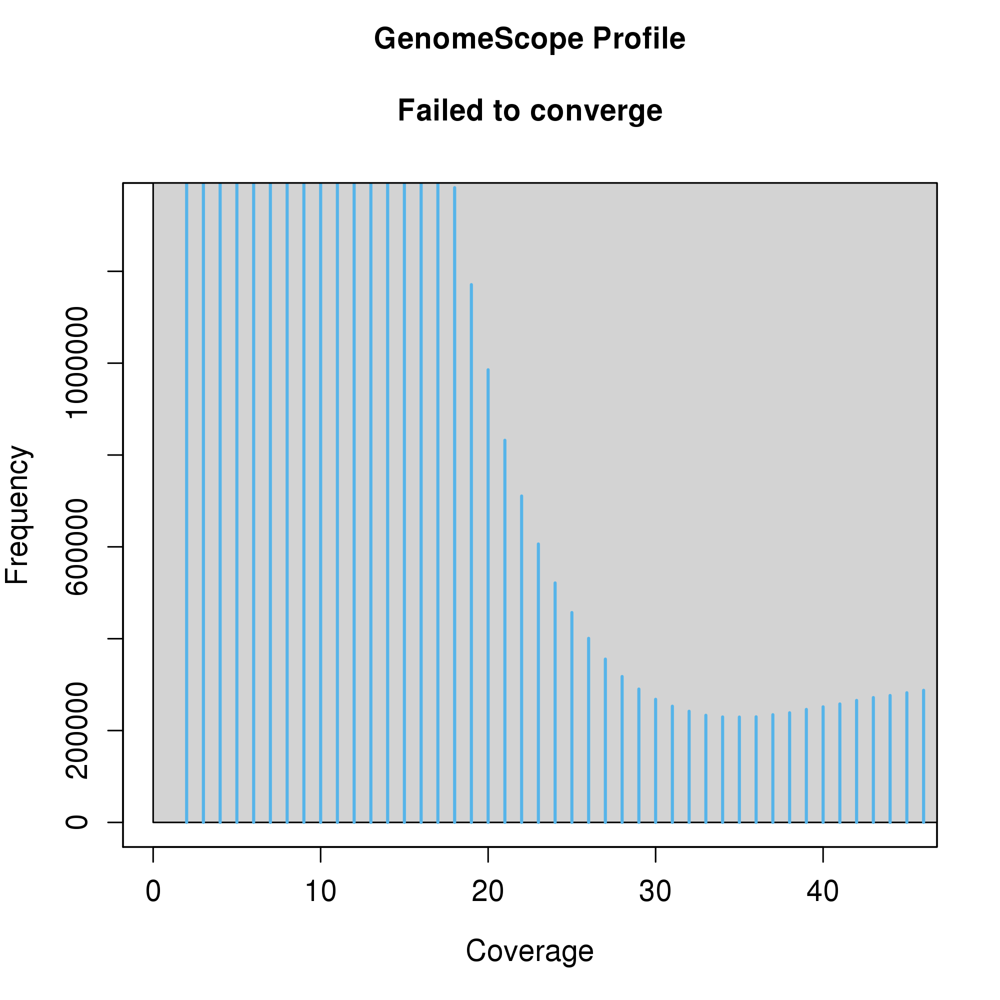

## Data QC

Trim the data with fastp https://github.com/OpenGene/fastp (removes adapter sequences, reads with too many Ns, low-quality sequences) and run FastQC on both the raw and trimmed reads https://github.com/s-andrews/FastQC. The main things to look out for are in the FastQC reports are read quality and GC content - GC content can show if there are contaminating sequences in the reads.

```
# FastQC pre-trim
fastqc -t 4 *.fq.gz

# Trim
for file in $(ls *.fq.gz)
do
	base=$(basename $file "_1.fq.gz")
	fastp -i ${base}_1.fq.gz -I ${base}_2.fq.gz -o ${base}_1.trimmed.fq.gz -O ${base}_2.trimmed.fq.gz
done

# FastQC post-trim
fastqc -t 4 *.trimmed.fq.gz
```

Looks like there is some minor contamination - something with 63% GC - likely just some bacteria or fungus, could even be a symbiont. The peak is small anyway so no biggie.


## Data exploration

To explore the data I will look at the kmer spectrum by running KMC https://github.com/refresh-bio/KMC and plotting with GenomeScope2. GenomeScope2 estimates genome size, heterozygosity rate and repeat content from unprocessed short reads http://qb.cshl.edu/genomescope/genomescope2.0/

```
for file in *_1.fq.gz
do
	base=$(basename $file "_1.fq.gz")
	# make a temporary directory for kmc to store intermediate files in
	mkdir ${base}_tmp/
	# combine reads into one file
	cat ${base}_1.fq.gz ${base}_2.fq.gz > ${base}_files.fq.gz
	# run KMC - count all 21-mers
	kmc -k21 -t30 -m64 -ci1 -cs10000 -fq ${base}_files.fq.gz ${base}_kmer_counts ${base}_tmp/
	# produce histogram of 21-mer counts
	kmc_tools transform ${base}_kmer_counts histogram ${base}_kmer_k21.hist -cx100000
done
```
The K-mer spectrum failed to converge - usually an indicator that there's something funky going on with the libraries or they're old.



Try running the same thing but on a subset of the reads. You can use seqtk for this (https://github.com/lh3/seqtk):

```
# subset reads - 0.1 means I'm taking 10% of the reads. -s100 is the seed - use any number but make sure to use the same for for forward and reverse files.
zcat BCM_EDSW220012746-1a_HL5LLDSX3_L4_1.fq.gz | seqtk sample -s100 BCM_EDSW220012746-1a_HL5LLDSX3_L4_1.fq.gz 0.1 | gzip > BCM_subset_30m_1.fq.gz
zcat BCM_EDSW220012746-1a_HL5LLDSX3_L4_2.fq.gz | seqtk sample -s100 BCM_EDSW220012746-1a_HL5LLDSX3_L4_2.fq.gz 0.1 | gzip > BCM_subset_30m_2.fq.gz
rm BCM_EDSW220012746*

for file in *_1.fq.gz
do
	base=$(basename $file "_1.fq.gz")
	mkdir ${base}_tmp/
	cat ${base}_1.fq.gz ${base}_2.fq.gz > ${base}_files.fq.gz
	kmc -k21 -t30 -m64 -ci1 -cs10000 -fq ${base}_files.fq.gz ${base}_kmer_counts ${base}_tmp/
	kmc_tools transform ${base}_kmer_counts histogram ${base}_0.1_subset_kmer_k21.hist -cx100000
done
```

The K-mer spectrum now looks a lot more normal. There is a large haploid peak - the X chromosome plus K-mers containing heterozygous sites. There's also a small bump around 60-80 coverage - probably repeat regions or maybe germline-restricted chromosomes (which could be at higher copy number in the germline, but would be lower in frequency because it's a small proportion of the tissue).


