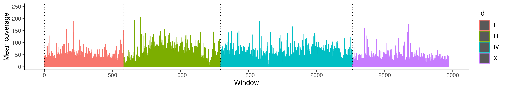

## Mapping against Bradysia coprophila

The only reference genome we have for a fungus gnat that is chromosome-level (or anywhere near) is Bradysia coprophila, our main study organism. We can map reads from this Lycoriella species against the reference, which may tell us a few things:
- Roughly how closely related the two species are
- How useful this species would be to use as an outgroup for population genetics
- Looking at read coverage after mapping may indicate if there have been any significant chromosomal rearrangements or sex chromosome turnover

We can use Bowtie2 (https://github.com/BenLangmead/bowtie2) to map, which has a sensitive option that works well for interspecific alignments, and it's also particularly good for large genomes (not that fungus gnats have large genomes, but they're much larger than e.g. bacteria)

```
echo "building bowtie index"
bowtie2-build Bcop_v2-chromosomes.fasta Bcop_v2-chromosomes.idx

echo "starting alignment"
bowtie2 --very-sensitive-local --threads 20 \
	-x Bcop_v2-chromosomes.idx \
	-1 BCM_EDSW220012746-1a_HL5LLDSX3_L4_1.trimmed.fq.gz \
	-2 BCM_EDSW220012746-1a_HL5LLDSX3_L4_2.trimmed.fq.gz \
	| samtools view -bS - > Lyco_vs_bcopv2.bam && samtools sort Lyco_vs_bcopv2.bam \
	> Lyco_vs_bcopv2.sorted.bam
```

Another option is bwa mem (http://bio-bwa.sourceforge.net/bwa.shtml). The aligners work differently (not sure exactly how, but probably something to do with the way they treat SNPs/mismatches and indels/gaps. Bwa takes longer to run (4-5 days vs 1 day for Bowtie2 with this data), which suggests it might be more sensitive...

```
bwa index Bcop_v2-chromosomes.fasta
bwa mem Bcop_v2-chromosomes.fasta BCM_EDSW220012746-1a_HL5LLDSX3_L4_1.trimmed.fq.gz BCM_EDSW220012746-1a_HL5LLDSX3_L4_2.trimmed.fq.gz | samtools view -b - > Lyco_vs_bcopv2.bam && samtools sort -@ 8 -o Lyco_vs_bcopv2.sorted.bam Lyco_vs_bcopv2.bam
```

After mapping, run samtools-flagstat (http://www.htslib.org/doc/samtools-flagstat.html) to get mapping statistics:

```
samtools flagstat Lyco_vs_bcopv2.sorted.bam
# or to print output to a new file:
samtools flagstat Lyco_vs_bcopv2.sorted.bam > Lyco_vs_bcopv2.flagstat

# Bowtie2:
709858794 + 0 in total (QC-passed reads + QC-failed reads)
709858794 + 0 primary
0 + 0 secondary
0 + 0 supplementary
0 + 0 duplicates
0 + 0 primary duplicates
109943081 + 0 mapped (15.49% : N/A)
109943081 + 0 primary mapped (15.49% : N/A)
709858794 + 0 paired in sequencing
354929397 + 0 read1
354929397 + 0 read2
68851520 + 0 properly paired (9.70% : N/A)
74888950 + 0 with itself and mate mapped
35054131 + 0 singletons (4.94% : N/A)
3622320 + 0 with mate mapped to a different chr
1703329 + 0 with mate mapped to a different chr (mapQ>=5)

# bwa mem:
714132776 + 0 in total (QC-passed reads + QC-failed reads)
709858794 + 0 primary
0 + 0 secondary
4273982 + 0 supplementary
0 + 0 duplicates
0 + 0 primary duplicates
220468627 + 0 mapped (30.87% : N/A)
216194645 + 0 primary mapped (30.46% : N/A)
709858794 + 0 paired in sequencing
354929397 + 0 read1
354929397 + 0 read2
159376840 + 0 properly paired (22.45% : N/A)
171770346 + 0 with itself and mate mapped
44424299 + 0 singletons (6.26% : N/A)
9051770 + 0 with mate mapped to a different chr
5283173 + 0 with mate mapped to a different chr (mapQ>=5)
```

So 15.49% of reads mapped with Bowtie2 and 30.46% for bwa mem. Note that just because the mapping rate is higher for bwa mem it doesn't mean that this is better - it could be more sensitive but less accurate. Either way, 30% is fairly low, but not too suprising seeing as this is a different genus (usually a species in the same genus should produce mapping rates of 80-90%, depending on how closely related the species are). It's probably not much use as an outgroup (unless looking at conserved genes), and this also means that looking at coverage probably won't be particularly informative. But let's do it anyway.

Here I'm using bedtools genomecov (https://bedtools.readthedocs.io/en/latest/content/tools/genomecov.html) to get per-base coverage along the genome (i.e. read coverage for each position at every single position in the genome - the size of the file it outputs is quite large as there's a row for every position i.e. 300m rows for this 300Mb genome). It requires indexing the bam file with samtools first. Then I'm running a custom R script (see ../scripts/get_100kb_cov_windows.R) which will compute mean coverage across 100Kb windows that can easily be plotted in R Studio. The script can easily be modified so that the windows are different sizes (which is useful if the contigs are smaller) or to make the windows overlapping. The script needs to be submitted on the cluster because it's working with such a large file.

```
for file in $(ls *.bam)
do
	base=$(basename $file ".bam")
	samtools index ${base}.bam
	bedtools genomecov -ibam ${base}.bam -d > per_base_cov.txt
	Rscript /data/ross/flies/analyses/Lycoriella_sp/scripts/get_100kb_cov_windows.R
	mv 100kb_cov_win_means.txt ${base}.100kb.win.means.txt
done
```

Plotting coverage in R Studio with ggplot2:

```
library(ggplot2)
library(dplyr)
setwd("/Users/robertbaird/Documents/analyses/Lycoriella")

# Read in coverage
cov.win.means <- read.table('Lyco_vs_bcopv2.sorted.100kb.win.means.txt', stringsAsFactors = FALSE, header=T, fill=T)
# if normalising cov based on autosomal coverage
# A.cov.win.means <- A.cov.win.means[which(cov.win.means$id == "II" | cov.win.means$id == "III" | cov.win.means$id == "IV"),]
# cov.win.means$norm_cov <- cov.win.means$cov.win.mean/((mean(A.cov.means$cov.win.mean))/2)

# order chromosomes for aesthetic plotting
chrom_order <- c("II", "III", "IV", "X")
cov.win.means <- cov.win.means %>%
  mutate(id =  factor(id, levels = chrom_order)) %>%
  arrange(id)
rownames(cov.win.means)<-1:nrow(cov.win.means)
cov.win.means$idx <- as.numeric(row.names(cov.win.means))
# this is so I can mark chromosome boundaries in the plot
ctgnames <-unique(cov.win.means$id)
ctgbound <-match(ctgnames,cov.win.means$id)

# plot
plot.cov.win.means <- ggplot(cov.win.means, aes(x=idx, y=cov.win.mean, col=id))+
  geom_bar(stat="identity")+
  geom_vline(xintercept=ctgbound, linetype="dotted")+
  ylim(0,250)+ # set a ylim if needed or if coverage is normalised
  theme_classic()+
  scale_x_continuous(breaks = scales::pretty_breaks(n = 10), position = "bottom") +
  labs(x = 'Position (10kb)', y = 'Mean coverage')

ggsave(
  "figs/lyco_v_bcopv2_cov.png",
  plot = plot.cov.win.means,
  device = "png",
  width = 28,
  height = 5,
  units = c("cm"),
  limitsize = TRUE,
)
```

Here is what the plot looks like.



The x axis refers to the midpoint of the 100kb window, so 500 = 500*100000 = 50Mb along the genome. It looks like particular regions have higher homology than others - e.g. the middle portion of chromosome III. X coverage is also fairly consistent and looks haploid compared to some 'diploid'-looking regions of the autosomes. This indicates conservation of the X chromosome (but we can't be too sure).

The best way to go ahead will be to assemble the genome as best we can and do coverage-based identification of the X chromosome.


